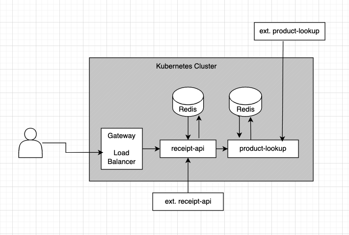
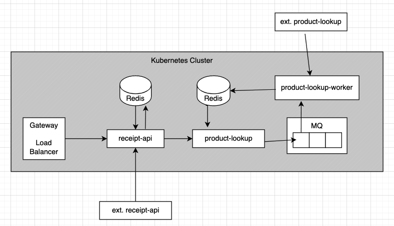

# Scan Receipt API example

## Description:

This implements an API that accepts a receipt image and returns structured API data (from Scan API and Product Lookup API).

The implementation uses a microservice-style architecture, enabling the scaling of application bottlenecks.

`receipt-api` gets the populated data from the database (`redis`).

It also populates it when receiving `POST` requests. It calls the external Scan API and the `product-lookup` microservice.

`product-lookup` accepts a list of `rsd/rpn` and fetches the data from the external product lookup API. It uses a `cache-aside` strategy for fetching, and only fetches products it has not seen before.

If we horizontally scale `product-lookup`, each replica _may_ replicate a fetch for an id between calls. The overhead of this should be minimal, however, if it proves problematic, we can use a message queue sytem to deduplicate requests between replicas:

In this architecture, we use a `message queue` with REQUEST-REPLY to satisfy our requests.

_Note_: The repo only contains the containers and does not include terraform/k8 etc.

###  Alternate Specification

Because the SCAN api is very slow, we can use a `jobs` based API:

On Scan Request, we immediately return status code `202` and an `id`, and provide an endpoint for status and fetching.

This way, we can fully support bulk uploads without tying up system resources too much (as we can let go of the request immediately).

## Running:

To run: `docker-compose up --build`

_Note_: There is a swagger UI in `receipt-api`. However, it is disabled by default as the external API is not fully documented and `fastify` tries to validate the schema.

## Specification:

We use a standard REST API:

- `POST http://localhost:4000/api/v1/scan_receipt`

  - Request:
    - `headers['Authorization']` - Your authorization header
    - `body[license_key]` - Your license key
    - `body[country]` - Country Code for receipt
    - `body[image]` - Image file to scan
  - Response:
    - Scan Receipt with unique `id` and populated Product Lookups

- `GET http://localhost:4000/api/v1/scan_receipt?id=id`
  - Request:
    - `id` - unique id for scanned receipt
  - Response:
    - Scan Receipt with unique `id` and populated Product Lookups